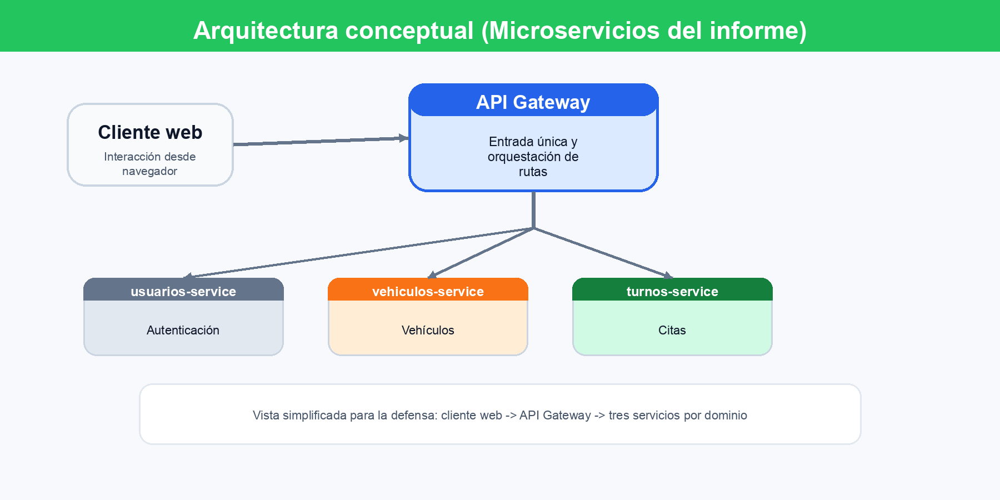

# AutoMax - Evaluación Parcial N.° 2

<p align="center">
  
</p>

Repositorio final del proyecto **AutoMax**, orientado a la gestión de un taller mecánico. Este repositorio reúne la aplicación ejecutable, la documentación académica y la evidencia técnica usada en la entrega.

## Resumen

AutoMax organiza la operación del taller en una solución web con autenticación, gestión de vehículos, turnos, servicios, repuestos y mensajes internos. La versión ejecutable corresponde al monolito, mientras que la documentación incluye una arquitectura conceptual de microservicios para la defensa académica.

## Estructura del repositorio

| Ruta | Contenido |
|---|---|
| `01_Monolito/backend/` | API REST con Spring Boot, JWT, controladores, servicios, repositorios y pruebas. |
| `01_Monolito/frontend/` | Interfaz en React con rutas protegidas, dashboards y módulos funcionales. |
| `03_Documentacion/` | Presentación, guion de defensa, pauta y evidencias del proyecto. |

## Arquitectura

```text
Cliente web → API Gateway → usuarios-service / vehiculos-service / turnos-service
```

La arquitectura anterior se conserva como referencia conceptual en el informe. La implementación real del proyecto es el monolito que integra frontend, backend y persistencia en MongoDB Atlas.

## Tecnologías utilizadas

- React 19
- React Router DOM
- Axios
- Spring Boot 3.2
- Spring Security
- JWT
- MongoDB Atlas
- Maven
- JUnit
- Mockito

## Ejecución local

### Backend

```bash
cd 01_Monolito/backend
mvn spring-boot:run
```

### Frontend

```bash
cd 01_Monolito/frontend
npm install
npm start
```

El frontend consume la API del backend en `http://localhost:8080/api`.

## Evidencias

- Presentación: `03_Documentacion/Presentacion_Defensa/Presentacion_Defensa_AutoMax.pptx`
- Guion de defensa: `03_Documentacion/Presentacion_Defensa/Guion_Defensa_AutoMax.md`
- Evidencia de pruebas: `03_Documentacion/Presentacion_Defensa/evidencia_tests.png`
- Documento de apoyo: `03_Documentacion/Evaluacion_Parcial_2/EVALUACION_PARCIAL_2_ESTUDIANTE.pdf`

## Observaciones

- El repositorio está preparado para revisión académica.
- No incluye dependencias compiladas como `node_modules/` ni `target/`.
- La configuración sensible del backend debe definirse con variables de entorno en despliegue.
